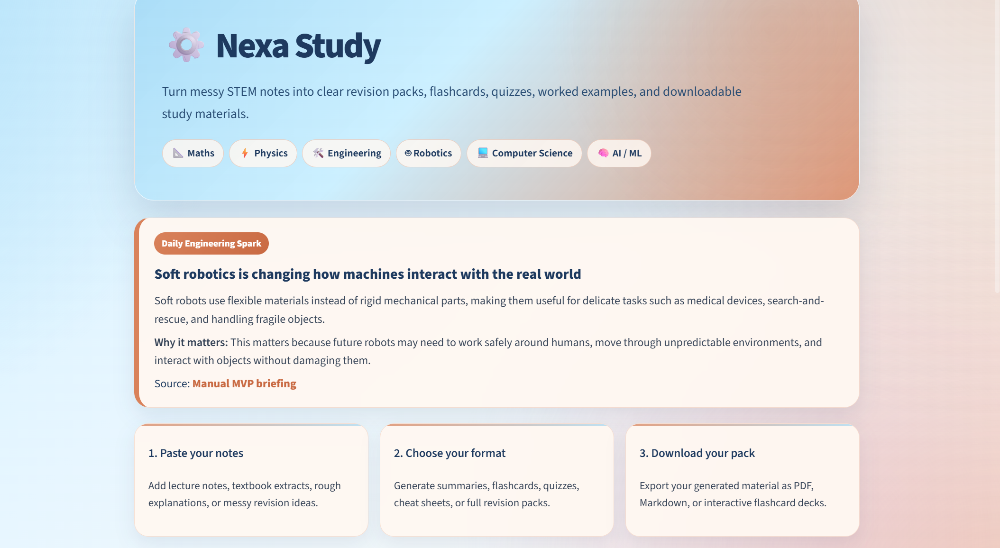
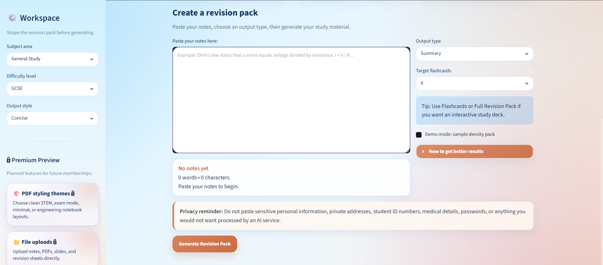
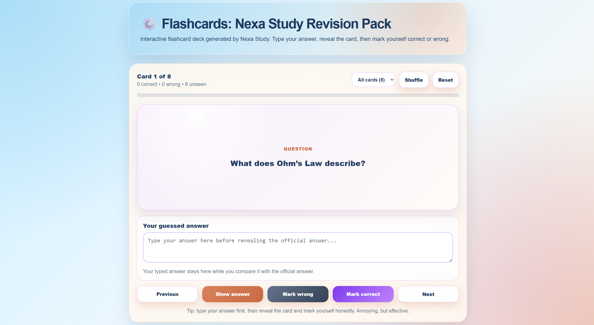

# Nexa Study

Nexa Study is an AI-powered study tool for STEM learners. It turns messy notes into structured revision materials, downloadable study packs, and interactive flashcard decks.

The app was built with Python, Streamlit, the OpenAI API, and ReportLab as a portfolio project and MVP for exploring AI-assisted study tools.






## Why I built this

I built Nexa Study because I wanted to explore a practical and affordable way for engineering students to turn messy notes into clearer revision materials.

As a robotics and AI engineering student, I know what it feels like to have pages of rough notes, formulas, explanations, and half-understood concepts that still need to be turned into something useful. A lot of AI tools can help with studying, but they can also be expensive, too general, or not focused enough on how STEM students actually revise.

Nexa Study is designed to help with that middle step: turning information into summaries, worked examples, flashcards, quizzes, and practice questions that are easier to use when studying.

For me, this project is also a way to explore how AI can support learning without making the experience feel overwhelming, overcomplicated, or disconnected from the student using it.


## Current features

- Daily Engineering Spark feature that highlights a short STEM concept
- Generate summaries from pasted notes
- Create full revision packs
- Generate flashcards from study material
- Generate quiz and practice questions
- Export revision material as PDF
- Export revision material as Markdown
- Download an interactive flashcard deck as an offline HTML file
- Use flashcard decks with:
  - animated card flipping
  - typed answer box
  - correct / wrong tracking
  - unseen card counter
  - session size selection
  - shuffle and reset controls
- Choose subject area, difficulty level, output style, and target flashcard count
- Demo mode for testing without using API credits
- Feedback and privacy sections
- Custom UI styling with a soft study-focused theme


## Interactive flashcard deck

Nexa Study can generate a downloadable interactive flashcard deck.

The deck opens in a browser and works offline. Allowing learners to type their answer, reveal the official answer, and mark themselves correct or wrong.




## Daily Engineering Spark

Nexa Study includes a Daily Engineering Spark feature: a short engineering, robotics, AI, or science concept designed to give learners a quick idea to think about before studying.

The goal is to make the app feel less static and more like a study companion that introduces useful ideas over time. Each spark includes:

- a short title
- a simple explanation
- why the idea matters
- a source or reference label

In the current MVP, the Daily Engineering Spark is manually set inside the app configuration. In future versions, the Daily Engineering Spark could be automated using a curated source pipeline that checks whether links are working, avoids obvious paywalled content, and falls back to another spark if a source is unavailable.


## Tech stack

- Python
- Streamlit
- OpenAI API
- ReportLab
- HTML and CSS
- Vanilla JavaScript for the offline interactive flashcard deck
- Git and GitHub


## Project structure

```text
app.py                Main Streamlit app
config.py             App settings, labels, and dropdown options
styles.py             Custom CSS styling
ai_utils.py           OpenAI prompt and API logic
pdf_utils.py          PDF generation helpers
flashcard_utils.py    Flashcard extraction and CSV export
html_utils.py         Interactive HTML flashcard deck generation
requirements.txt      Python dependencies
```


## How to run locally

Clone the repository:

```bash
git clone https://github.com/CTMW13/nexa-study.git
cd nexa-study
```

Create and activate a virtual environment:

```bash
python -m venv .venv
```

On Windows PowerShell:

```bash
.venv\Scripts\Activate.ps1
```

Install dependencies:

```bash
pip install -r requirements.txt
```

Create a `.env` file in the project root and add your OpenAI API key:

```text
OPENAI_API_KEY=your_api_key_here
```

Run the app:

```bash
streamlit run app.py
```

## Demo and live mode

Nexa Study includes a demo mode that uses sample content and does not use API credits.

Live generation requires an OpenAI API key stored locally in `.env` or in Streamlit secrets when deployed. API keys should never be committed to GitHub.


## Next features

Planned improvements/upgrades include:

- File uploads for notes, PDFs, and slides
- More PDF styling themes
- Saved revision history
- Better flashcard generation controls
- Optional spaced repetition logic
- More subject-specific templates
- Improved mobile layout
- Configurable model and cost controls before public beta deployment
- Note length limits and private access controls for live generation
- More advanced privacy controls
- Deployment as a public demo
- Automate the Daily Engineering Spark using curated STEM sources, with checks for working links, paywall-free access, and fallback content if a source is unavailable.


## What I learned

Building Nexa Study helped me practise:

- Structuring a Python project into separate modules
- Building an interactive web app with Streamlit
- Working with API-based AI generation
- Designing prompts for structured educational outputs
- Creating PDF and Markdown exports
- Generating offline interactive HTML tools
- Styling a user interface with custom CSS
- Using Git and GitHub for version control
- Iterating on an MVP based on usability feedback


## AI-assisted development note

This project was developed with AI assistance as part of my learning process. I designed the product direction, tested the features, made implementation decisions, debugged issues, and iterated the user experience while using AI support to help write, explain, and refactor code.


## Privacy note

Nexa Study processes notes pasted into the app to generate study materials. Users should avoid entering sensitive personal information, private documents, passwords, student ID numbers, medical details, or anything they would not want processed by an AI service.


## Status

Nexa Study is currently an MVP and portfolio project.


## Copyright

Copyright © 2026 Courtney Walsh. Nexa Study. All rights reserved.

This repository is public for portfolio and review purposes. No licence is currently granted for copying, distribution, modification, or commercial use.